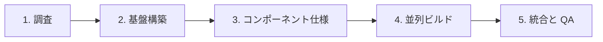

<div align="center">

# AI ウェブサイトクローンテンプレート

### 1つのコマンドで、あらゆるウェブサイトをクローン

AI コーディングエージェントに URL を渡すだけで、ウェブサイトをクリーンな Next.js アプリとして再現できます。

**最良の結果を得るには [Claude Code](https://docs.anthropic.com/en/docs/claude-code) + Opus 5 を推奨します。Codex、Cursor、OpenCode にも対応しています。**

[](https://github.com/JCodesMore/ai-website-cloner-template/generate) [](https://discord.gg/hrTSX5yTpB)

[クイックスタート](#クイックスタート) · [デモを見る](#デモ) · [対応プラットフォーム](#対応プラットフォーム)

<a href="https://github.com/JCodesMore/ai-website-cloner-template/blob/master/LICENSE"></a> <a href="https://github.com/JCodesMore/ai-website-cloner-template"></a> 

  <a href="https://trendshift.io/repositories/24302?utm_source=repository-badge&amp;utm_medium=badge&amp;utm_campaign=badge-repository-24302" target="_blank" rel="noopener noreferrer"></a> <a href="https://www.star-history.com/jcodesmore/ai-website-cloner-template/"><picture><source media="(prefers-color-scheme: dark)" srcset="https://api.star-history.com/badge?repo=JCodesMore/ai-website-cloner-template&amp;theme=dark" /><source media="(prefers-color-scheme: light)" srcset="https://api.star-history.com/badge?repo=JCodesMore/ai-website-cloner-template" /></picture></a>

</div>

---

## デモ

[](https://youtu.be/O669pVZ_qr0)

> 上の画像をクリックすると、YouTube でデモ全編を視聴できます。

## クイックスタート

> **重要：** まず GitHub の **Use this template** ボタンを使用して、自分用のコピーを作成してください。ウェブサイトプロジェクトのためにこのテンプレートリポジトリを直接クローンしたり、生成したウェブサイトのプルリクエストをこのリポジトリに作成したりしないでください。

1. **このテンプレートから自分のリポジトリを作成する**

   このプロジェクトの GitHub ページで **Use this template**、続いて **Create a new repository** をクリックします。

   新しいリポジトリに名前を付け、公開または非公開を選択してから **Create repository** をクリックします。GitHub に **Include all branches** オプションが表示された場合は、オフのままでかまいません。

   これにより、独立した自分専用のプロジェクトが作成されるため、ウェブサイトへの変更はメインテンプレートに戻されず、自分のアカウント内に保持されます。

2. **新しいリポジトリを自分のコンピューターで開く**

   GitHub がコピーを作成したら、その新しいリポジトリを開きます。**Code** をクリックし、好みのコーディングツールで新しいリポジトリを開くかクローンします。

   ターミナルを使用する場合、コマンドは次のようになります。

   ```bash
   git clone https://github.com/YOUR-USERNAME/YOUR-NEW-REPOSITORY.git
   cd YOUR-NEW-REPOSITORY
   ```

3. **依存関係をインストールする**
   ```bash
   npm install
   ```
4. **AI エージェントを起動する** — Claude Code を推奨：
   ```bash
   claude --chrome
   ```
5. **各エージェントの方法でスキルを実行する**：

   - Claude Code または Cursor：`/clone-website <target-url1> [<target-url2> ...]`
   - Codex：`$clone-website <target-url1> [<target-url2> ...]`
   - OpenCode：`clone-website スキルを使って <対象URL> をクローンして`

6. **カスタマイズする**（任意）— 基本のクローンが構築された後、必要に応じて変更します

> ワークフローはテンプレートに含まれています。スキルの追加インストールや同期コマンドは不要です。プロジェクトの指示は `AGENTS.md` にあります。

## 対応プラットフォーム

| エージェント                                                  | 状態                  |
| ------------------------------------------------------------- | --------------------- |
| [Claude Code](https://docs.anthropic.com/en/docs/claude-code) | **推奨** — Opus 5     |
| [Codex CLI](https://github.com/openai/codex)                  | 対応                  |
| [OpenCode](https://opencode.ai/)                              | 対応                  |
| [Cursor](https://cursor.com/)                                 | 対応                  |

## 前提条件

- [Node.js](https://nodejs.org/) 24 以降
- AI コーディングエージェント（[対応プラットフォーム](#対応プラットフォーム)を参照）

## 技術スタック

- **Next.js 16** — App Router、React 19、TypeScript strict
- **shadcn/ui** — Radix プリミティブ + Tailwind CSS v4
- **Tailwind CSS v4** — oklch デザイントークン
- **Lucide React** — デフォルトのアイコン（クローン作成時に抽出した SVG に置き換えられます）

## 仕組み

`/clone-website` スキルは、複数フェーズのパイプラインを実行します。



1. **調査** — スクリーンショット、デザイントークンの抽出、インタラクションの網羅的な確認（スクロール、クリック、ホバー、レスポンシブ）
2. **基盤構築** — フォント、色、グローバル設定を更新し、すべてのアセットをダウンロード
3. **コンポーネント仕様** — 正確に算出された CSS 値、状態、動作、コンテンツを含む詳細な仕様ファイルを `docs/research/components/` に作成
4. **並列ビルド** — セクションまたはコンポーネントごとに 1 つずつ、git worktree 内でビルダーエージェントを実行
5. **統合と QA** — worktree をマージしてページを接続し、元のサイトとのビジュアル差分を確認

各ビルダーエージェントには、正確な `getComputedStyle()` の値、インタラクションモデル、複数状態のコンテンツ、レスポンシブのブレークポイント、アセットのパスを含む完全なコンポーネント仕様がインラインで渡されます。エージェントが推測で補うことはありません。

## 使用例

- **プラットフォーム移行** — 所有しているサイトを WordPress、Webflow、Squarespace からモダンな Next.js コードベースへ再構築
- **ソースコードを紛失した場合** — サイトは公開中でも、リポジトリがなくなった、開発者が離任した、または技術スタックが旧式になった場合に、コードをモダンな形式で取り戻す
- **学習** — 実際のコードを扱いながら、本番サイトが特定のレイアウト、アニメーション、レスポンシブ動作をどのように実現しているかを分解して理解

## 想定していない用途

- **フィッシングまたはなりすまし** — このプロジェクトを、欺瞞的な目的、なりすまし、または法律に違反する活動に使用してはなりません。
- **他者のデザインを自作と偽ること** — ロゴ、ブランドアセット、オリジナルの文章は、それぞれの所有者に帰属します。
- **利用規約への違反** — 一部のサイトではスクレイピングや複製が明示的に禁止されています。事前に確認してください。

## プロジェクト構成

```
src/
  app/              # Next.js ルート
  components/       # React コンポーネント
    ui/             # shadcn/ui プリミティブ
    icons.tsx       # 抽出された SVG アイコン
  lib/utils.ts      # cn() ユーティリティ
  types/            # TypeScript インターフェース
  hooks/            # カスタム React フック
public/
  images/           # 対象サイトからダウンロードした画像
  videos/           # 対象サイトからダウンロードした動画
  seo/              # ファビコン、OG 画像
docs/
  research/         # 調査結果とコンポーネント仕様
  design-references/ # スクリーンショット
.agents/skills/
  clone-website/    # 正本スキルと検査リファレンス
.claude/commands/
  clone-website.md  # Claude Code 用の薄いブリッジ
AGENTS.md           # エージェント指示（唯一の参照元）
CLAUDE.md           # Claude Code 設定（AGENTS.md を読み込み）
```

## コマンド

```bash
npm run dev    # 開発サーバーを起動
npm run build  # 本番ビルド
npm run lint   # ESLint チェック
npm run typecheck # TypeScript チェック
npm run check  # lint + typecheck + build を実行
```

### Docker を使用する場合

```bash
docker compose up app --build # アプリをビルドして起動
docker compose up dev --build # ポート 3001 で開発モードを起動
```

## エージェント対応

プロジェクトは `.agents/skills/clone-website/` に1つのポータブルな Agent Skill を保持します。Codex、Cursor、OpenCode はこれを直接読み取ります。Claude Code は `.claude/commands/clone-website.md` の小さなコマンドブリッジを使用するため、他のエージェントに重複したスキルを公開せずに `/clone-website` と引数を利用できます。

変更は正本スキルに直接加えてください。プラットフォーム別の生成コピーや同期スクリプトはありません。

## Star History


## ライセンス

MIT

<sub>言語: <a href="README.md">English</a> · 日本語 · <a href="README.zh-CN.md">简体中文</a></sub>
